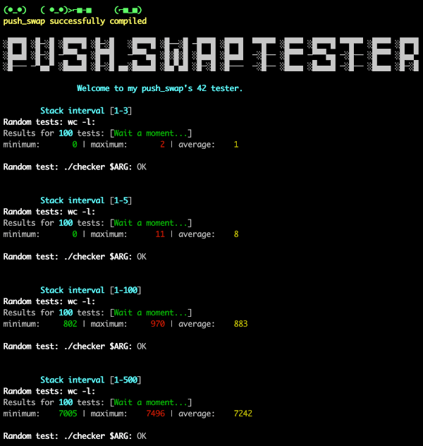

# push_swap_tester, how to use it

__first:__
	be sure that your checker's name is 'checker' and not 'checker_mac' or 'checker_linux' or else

__second:__
	put the push_swap_tester folder at the root of your push_swap's
	
__third:__
	launch 
	```
	sh run_tests.sh
	```
	
__note:__
	if you want to change the number of tests to perform, change the nb_tests value in test.sh
	
