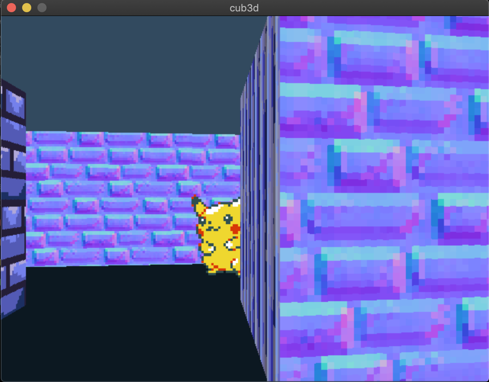

# cub3d

Projet de l'école 42, inspiré du jeu Wolfenstein 3D. Considéré comme le premier FPS jamais développé, il vous permettra d’explorer la technique du raycasting. Votre objectif est de faire une vue dynamique au sein d’un labyrinthe.



# Ressouces

## Minilibx

<a href="https://elearning.intra.42.fr/searches/search?query=minilibx">Vidéos de l'intra de 42 évoquant la minilibx</a><br />
<a href="https://harm-smits.github.io/42docs/libs/minilibx.html">Tuto minilibx fait par des étudiants</a><br />
<a href="https://github.com/keuhdall/images_example">Explanations on how the images are working on minilibx</a><br />
<a href="https://github.com/qst0/ft_libgfx#minilibx">minilibx's man and ressources</a><br />

## Tutos raycasting et mises en pratique

<a href="https://lodev.org/cgtutor/raycasting.html">Lode's tuto cpp</a><br />
<a href="http://forums.mediabox.fr/wiki/tutoriaux/flashplatform/affichage/3d/raycasting">Traduction et adaptation FR sur forums mediabox</a><br />
<a href="http://www.playfuljs.com/a-first-person-engine-in-265-lines/">A first-person engine in 265 lines (javascript)</a><br />
<a href="http://zupi.free.fr/PTuto/index.php?ch=ptuto&p=s3De">Tuto raycasting avec bibli SDL</a><br />
<a href="https://www.youtube.com/watch?v=gYRrGTC7GtA">Video Make Your Own Raycaster Game</a><br />
<a href="https://www.youtube.com/watch?v=eOCQfxRQ2pY&t=795s">Video Wolfestein 3D's map renderer</a><br />
Good video <a href="https://www.youtube.com/watch?v=TOEi6T2mtHo">one</a> and <a href="https://www.youtube.com/watch?v=vYgIKn7iDH8">two</a> on raycasting by The Coding Train<br />
Other good videos <a href="https://www.youtube.com/watch?v=yPRkuQe0KxE">one</a> and <a href="https://www.youtube.com/watch?v=_HSJbFBkHdk">two</a><br />
<a href="https://permadi.com/1996/05/ray-casting-tutorial-table-of-contents/">Complete tuto</a><br />
<a href="https://www.youtube.com/watch?v=xW8skO7MFYw">Video Code-It-Yourself! First Person Shooter (Quick and Simple C++)</a><br />
<a href="youtube.com/watch?v=W5P8GlaEOSI">Video DDA' Algorithm</a><br />

## BMP

<a href="http://projet.eu.org/pedago/sin/ISN/7-format_BMP.pdf">Format BMP</a><br />
<a href="http://www.apprendre-en-ligne.net/info/images/formatbmp.pdf">Format BMP tableau explicatif</a><br />
<a href="http://fvirtman.free.fr/recueil/01_09_02_testbmp.c.php">Lire et écrire des fichiers image BMP</a><br />
<a href="https://web.archive.org/web/20080912171714/http://www.fortunecity.com/skyscraper/windows/364/bmpffrmt.html">The .bmp file format</a><br />
<a href="https://stackoverflow.com/questions/2654480/writing-bmp-image-in-pure-c-c-without-other-libraries">Writing BMP image in pure c/c++ without other libraries</a><br />
<a href="http://www.normalesup.org/~feuvrier/enseignement/2008/M2/site003.html">Exemples de structures bitmap tirés  de la documentation Microsoft.</a><br />
<a href="https://fulmanski.pl/zajecia/wdi/zajecia_20152016/bmp/dane/bmp_header_format.html">Description du Header Format offset par offset.</a><br />

## LEAKS
```
• CUB=Cub3D;MAP=map.cub;valgrind --tool=memcheck --leak-check=full --leak-resolution=high --show-reachable=yes --log-file=valgrind_log ./$CUB $MAP;grep -A1 "valgrind" valgrind_log|grep $CUB
• valgrind --leak-check=yes ./Cub3D map.cub
Cependant, valgrind a tendance à segfault avec la mlx.
Donc utiliser : 
-> la commande leaks avec un while (1) avant exit()
-> -fsanitize=address pour les overflows
-> astuces pour forcer leaks à être plus précis :
Placer un while (1) avant exit() qui traite l'event "Je veux quitter le
programme".
Recompiler le programme avec -g (sans fsanitize), et l'executer. Lancer le programme avec
MallocStackLogging=1 en ligne de commande.
Exemple : MallocStackLogging=1 ./a.out
Faire les tests, quitter le programme. Grâce au while, le programme se met en pause sur
exit(), et ne quitte pas. Dans un terminal séparé, lancer 'leaks [nom]'. Il devrait alors
afficher tous les détails des leaks, notamment la stack d'appel des fonctions jusqu'au
malloc de base. 
Pour libs externes incluses au projet (libft, mlx...) penser aussi à les compiler avec -g,
pour avoir une précision de debug maximale. 
```

## Textures et sprites

<a href="https://opengameart.org/content/colored-metal-tiles-1b">Textures des murs</a><br />
<a href="https://www.pokepedia.fr/Pikachu/Imagerie">Pikachus</a><br />
<a href="https://thatguynm.itch.io/pixelated-textures">Textures des murs 2</a><br />
<a href="https://free-game-assets.itch.io/free-enemy-sprite-sheets-pixel-art">Ennemi</a><br />
https://anyconv.com/fr/convertisseur-de-png-en-xpm/<br />
https://convertio.co/fr/png-xpm/<br />

````
100/100
